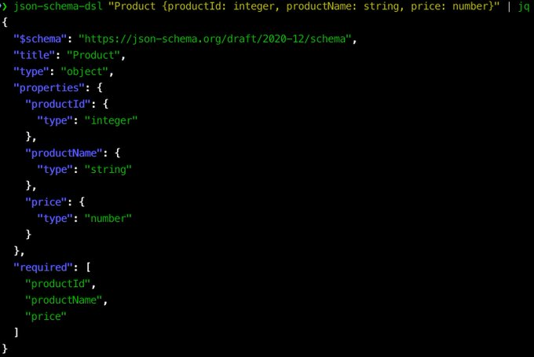
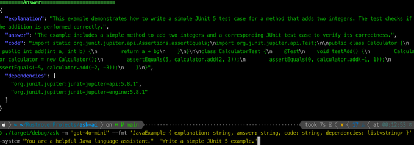
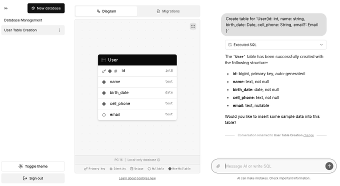
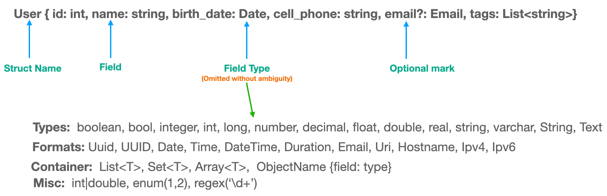

JSON Schema DSL
==================

A simple DSL to generate JSON Schema with one-liner style.

# Why JSON Schema DSL?

1. Make JSON Schema concise:
   

2. AI friendly: Function calling, Structured Output with simple DSL:
   

3. Schema friendly for CSV, Excel, Text2SQL:
   

# Get Started

CLI: `cargo install json-schema-dsl`

```shell
$ json-schema-dsl "User{ id: int, name: string, email: Email}"
```

Output as following:

```json
{
  "$schema": "https://json-schema.org/draft/2020-12/schema",
  "title": "User",
  "type": "object",
  "properties": {
    "id": {
      "type": "integer"
    },
    "name": {
      "type": "string"
    },
    "email": {
      "type": "string",
      "format": "email"
    }
  },
  "required": [
    "id",
    "name",
    "email"
  ]
}
```

Rust library: `cargo add json-schema-dsl serde_json`

```rust
fn main() {
    let struct_text = "User {id: int, name: string, email: Email}";
    let json_schema = json_schema_dsl::to_json_schema(struct_text).unwrap();
    println!("{}", serde_json::to_string_pretty(&json_schema).unwrap());
}
```

# Syntax



`User { id: int, name: string, birth_date: Date, email?: Email, tags: List<string>}`

- Object Name: starts with capital character, such as `ObjectName { field: type }`.
- Field name: starts with lower-case character.
- Optional field: `field?: type`

### Basic Types

JSON Schema basic types:

- `string`: aliases:  `varchar`, `Text`, `String`, `bytes` or `bytea`(base64)
- `integer`: aliases: `int`, `bigint`, `long`, `serial`, `bigserial`,`int32`, `int64`, `int96`, `int128`
- `number`: aliases: `float`, `double`, `real`, `decimal`
- `boolean`: aliases: `bool`

### array Types

array type is alike `List<T>`, and T is a basic type or format name.

- `List`: aliases: `list`
- `Array`: aliases: `array`
- `Set`(uniqueItems): aliases: `set`

### object Type

Declare object type: `field: ObjectName {field: type}`.

**Attention**: `ObjectName` should start with Capital Character.

### Formats

JSON Schema formats, and name should start with a capital letter:

- `Date`
- `Time`
- `Datetime`
- `Timestamp`
- `Interval`
- `Duration`
- `Email`
- `Hostname`
- `Domainname`
- `Ipv4`
- `Ipv6`
- `Uri`
- `Path`: `/path/to/file`
- `S3Path`: `s3://bucket/key`
- `Uuid` or `UUID`
- `Ulid` or `ULID`
- `Json` or `JSON`: JSON text
- `Xml` or `XML`: XML text
- `Color`: `#F7F8FA`
- `Isbn`: `978-3-16-148410-0`
- `SemVer`: `1.2.3`
- `PhoneNumber`: `+1-202-555-0192`
- `CreditCard`: `4111 1111 1111 1111`
- `Currency`: `USD`, `CNY`
- `Language`: `en`, `zh-CN`
- `Locale`: `en-US`, `zh-CN`
- `MimeType`: `application/json`
- `Base64`: base64 encoded string

### Misc

- range: `age: int(18,)`, `age: int(,150)` or `age: int(1,18)`
- string length range: `nick: string(6,32)`, `varchar(32)`
- array items length range: `list<string>(2)`, `list<float>(1536)`
- tuple: `income: [int, string]`
- enum: `enum('a', 'b', 'c')` or `enum(1, 2, 3)`
- regex: `regex('^[a-z]+$')`
- anyOf: `field: type1|type2`, no space between types
- additionalProperties: `{field: type, ...}`, ellipsis before `}`.

# References

* JSON Schema: https://json-schema.org/
* JSON Schema formats: https://json-schema.org/understanding-json-schema/reference/string#built-in-formats
* M-Schema: a semi-structure representation of database schema - https://github.com/XGenerationLab/M-Schema

